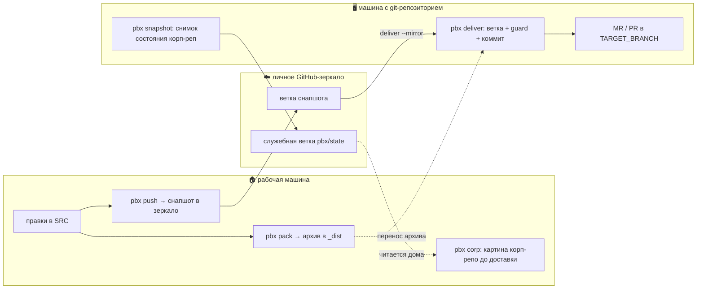

# pbx — доставка проектов между двумя машинами

Один самодостаточный bash-скрипт: упаковать проект на одной машине, разложить его
в git-репозиторий на другой и открыть MR/PR. Без CI, без демонов, без зависимостей —
только `git`, `tar`, `rsync` и `bash`.

## Какую боль это решает

Бывает так, что писать код удобно на одной машине, а создавать merge request можно
только с другой. Например: разработка идёт на домашнем ПК (WSL, доступа к корпоративному
gitlab нет), а MR открывается с рабочего ноутбука, где этот доступ есть. Между ними —
ручной обряд: собрать архив, скопировать, распаковать, не забыть про `.env` и
`node_modules`, сделать ветку, коммит, пуш. Долго и легко ошибиться.

`pbx` сворачивает это в две команды: `pack` там, где пишешь код, и `deliver` там, где
лежит репозиторий. Реестр проектов на каждой машине помнит, что где лежит, так что
не надо каждый раз печатать пути.

И ещё одна, менее очевидная боль. `deliver` раскладывает архив в целевой репозиторий
**зеркалом** (`rsync --delete`): рабочее дерево становится точной копией снимка. Если
снимок отстал от целевой ветки, зеркало может молча откатить чужую влитую работу — и это
уедет в MR одним коммитом с твоей правкой. Однажды так и случилось: доставка затёрла
ролевую логику из чужого MR. Поэтому у `deliver` теперь есть [страховка](#страховка-deliver-guard).

## Как устроен поток

## Команды

    pbx add     <имя> [путь]                          завести проект в реестр (SRC=путь|$PWD)
    pbx scan    (--repo|--src) [каталог] [--dry-run]  заполнить реестр из найденных репо
    pbx list                                          показать проекты (реестр ∪ WORKSPACE)
    pbx status  [имя] [--json]                        сводка: ветка, правки, дрейф, зеркало
    pbx pack    <имя>                                 упаковать SRC в _dist/<имя>.tar.gz
    pbx push    <имя> [ветка]                         снапшот рабочего дерева → ветка зеркала (MIRROR)
    pbx deliver <имя> <ветка> <сообщение> [архив] [--yes] [--mirror | --patch [--from <ветка зеркала>] [--base <sha>]]
                                                      разложить в REPO, ветка, коммит, MR/PR; --patch — только наш дифф
    pbx snapshot [имя]                                НОУТ: снимок корп-состояния → pbx/state + корп-dev → corp-dev зеркала
    pbx start   <имя> <ветка>                         ДОМ: новая задача — ветка в SRC от corp-dev зеркала
    pbx corp    [имя] [--json]                        ДОМ: показать снимок корп-состояния из зеркала
    pbx ctx     [проект] [--json]                     ДОМ: вердикт готовности к доставке — сравнение дом↔корп по снимку (ok/warn/danger/unknown, страховка SUP-2603)
    pbx log     [имя]                                 диагностика для ИИ-агента (stdout + лог-файл)
    pbx self-update [--check]                         НОУТ: обновить pbx из личного зеркала инструмента (SELF_MIRROR в ~/.config/pbx/self.conf; ветка зеркала: SELF_BRANCH=/PBX_SELF_BRANCH, дефолт main); --check — только проверить
    pbx help

## Интерактивное меню

Голый `pbx` в терминале открывает меню: стрелки ↑/↓ (или j/k, или цифры),
Enter — выбрать, Esc/q — отмена. Пункты pack/push/deliver/log ведут через
выбор проекта; deliver дальше спросит ветку (подставит `feature/`) и
сообщение — и выполнит обычный `pbx deliver` со всеми страховками (guard
остаётся). Пункты snapshot и corp проходят сразу по всем проектам с MIRROR.

Меню включается только когда stdin и stdout — терминал. Скрипты и ИИ-агенты
ничего не заметят: `pbx` без аргументов в пайпе печатает справку, как раньше.
Отключить насовсем: `PBX_NO_MENU=1`.

Цвет теперь гейтирован: в пайпе/редиректе вывод — чистый plain-текст
(соблюдается `NO_COLOR`, `TERM=dumb`).

## Статус проектов

`pbx status` — сводка по всем проектам: ветка, незакоммиченные правки, что не
упаковано с последнего `pack`, свежесть архива. `pbx status <проект>` — по
одному, `pbx status --json` — машиночитаемо (для ИИ-агентов и скриптов).

`pack` теперь пишет рядом с архивом манифест `<проект>.meta` (коммит, ветка,
время упаковки) — по нему `status` считает дрейф точно, по коммитам; без
манифеста дрейф оценивается эвристикой (помечается `~`).

## Транспорт через личное GitHub-зеркало

Вместо ручного переноса архива: дома `pbx push <проект> [ветка]` — снапшот
рабочего дерева SRC (включая незакоммиченное) уезжает коммитом в ветку личного
зеркала (ключ `MIRROR=` в реестре). На ноуте `pbx deliver <проект> <ветка>
<сообщение> --mirror` — та же доставка с тем же guard, но источник — ветка
зеркала, а не архив. Архивный путь никуда не делся — работает без `--mirror`.

Отличие от pack: снапшот уважает `.gitignore` SRC — gitignored-файлы
(например `.env`) в зеркало НЕ уезжают (архив их тащил). История снапшотов в
зеркале сохраняется (parent-chain), `--force` не используется.

Auth ноута (root): рекомендован HTTPS + fine-grained PAT (скоуп — только
зеркала, Contents Read/Write, срок ~90 дней) через `git credential-cache`
или `~/.git-credentials` (600). Токен НЕ вписывать в URL реестра. При
отсутствии/протухании токена pbx падает с понятной ошибкой, не виснет.

## Обратный поток: состояние корп-репозиториев (Э3)

Дом не видит корп-GitLab. Чтобы планировать доставку по фактам (страховка от
«устаревший снимок молча откатывает чужую работу», класс SUP-2603):

- **Ноут, конец дня:** `pbx snapshot` — снимает состояние всех корп-реп
  (ветки, лог dev, ahead/behind доставленных веток) в 4 маленьких файла и
  коммитит их в служебную ветку `pbx/state` личного зеркала (MIRROR).
  Git-объекты корп-истории в зеркало НЕ уезжают — только текстовые метаданные
  (sha, сабжекты, имена веток).
- **Дом, перед доставкой:** `pbx corp [проект]` — показывает снимок: возраст,
  верхушку dev, доставленные ветки с ahead/behind. Для ИИ-агента:
  `pbx corp <проект> --json`.
- **Дом, автовердикт (Э4):** `pbx ctx [проект]` — та же страховка от SUP-2603,
  но уже не сырой снимок, а готовый вердикт `ok/warn/danger/unknown` с
  причинами (дрейф от dev, грязный REPO, протухший снимок, недоставленные
  ветки). `pbx ctx --json` — для ИИ-агента. С Э6 ctx не шумит про транспорт:
  «архив протух» не показывается вовсе (доставка идёт через зеркало, свежесть
  архива — в `pbx status`), «push отстаёт» — только когда дерево SRC отличается
  от корп-tip, то есть дома есть что доставлять.

Auth — тот же, что для транспорта (SSH дома, HTTPS+PAT на ноуте, см. выше).
Снимок старше 24 ч помечается протухшим. Без VPN на ноуте снимок делается по
последним известным remote-refs с пометкой `fetch_ok=false`.

## Патч-доставка от свежего корпа (Э5)

Зеркальная доставка (`--mirror`, архив) раскладывает весь снимок через
`rsync --delete`: если дом отстал от корпа, она молча откатывает чужую
влитую работу и файлы DevOps. Патч-режим переносит **только наш дифф**.

- **Ноут:** `pbx snapshot` кроме снимка выкладывает корп-`dev` в зеркало
  веткой `corp-dev` (`corp-<BASE_BRANCH>`). Это осознанно тащит корп-историю
  в личное зеркало; выключается `CORP_SYNC=0` в conf проекта. Ветка
  `pbx/state` по-прежнему без корп-родителей.
- **Дом:** `pbx start <проект> <ветка>` — ветка в SRC от `corp-dev` зеркала
  (нужно чистое дерево). История дома совпадает с корпом по SHA, `pbx ctx`
  даёт точный вердикт. Дальше правки и `pbx push <проект> <ветка>`.
- **Ноут:** одна команда —

      pbx deliver <проект> feature/SUBA-123-x "Сообщение" --patch --from <домашняя ветка>

  `checkout dev` → `pull` → fetch ветки зеркала → дифф «база → снапшот»
  (база — общий предок с `dev`, то есть коммит, от которого делали
  `pbx start`) → `git apply --index` на свежий `dev` → guard → commit → MR.
  `--from` по умолчанию совпадает с именем ветки доставки.

Если патч не лёг (эти места в корпе уже менялись), ничего не коммитится:
ветка удаляется, REPO остаётся на чистом `dev`. Ветку, начатую не через
`pbx start` (нет общей истории с корпом), можно доставить с явной базой
`--base <sha>` — коммит, от которого считать наш дифф.

### Быстрый snapshot и сетевые повторы (Э7)

- `pbx snapshot` не создаёт новый коммит в `pbx/state`, если корп-состояние
  не изменилось с прошлого снимка (сравнение без метки времени) и прошлому
  снимку меньше 12 ч (`PBX_SNAPSHOT_REFRESH_SEC`, половина срока «снимок
  протух» у ctx). Принудительно — `PBX_SNAPSHOT_FORCE=1`.
- `corp-dev` не пушится, если в зеркале уже тот же SHA (сверка `ls-remote`).
- Сетевые операции с зеркалом (`start`, `deliver --patch`, сверки snapshot)
  повторяются до `PBX_NET_TRIES` (3) раз по `PBX_NET_TIMEOUT` (45) с: GitHub
  временами подвисает. `pbx start` различает «ветки нет» и «зеркало не ответило».

### Предстарт deliver (Э8)

Перед доставкой `deliver` проверяет корп-репо: если оно не на `BASE_BRANCH` —
явно переключает (сообщает об этом); если в нём незакоммиченные правки
(остаток прерванной доставки) или ветка доставки уже существует — останавливается
до любых действий и подсказывает команду. После пуша MR репо возвращается на
`BASE_BRANCH`, чтобы следующая доставка и snapshot стартовали с базовой ветки.

## Рабочий процесс

    # рабочая машина
    pbx add sup /home/me/sup
    pbx pack sup                       # → _dist/sup.tar.gz (без node_modules/.git/.env)
    scp _dist/sup.tar.gz host:/root/_dist/

    # машина с репозиторием
    pbx deliver sup feature/PROJ-123-fix "Починить X"

## Страховка (deliver-guard)

Перед коммитом `deliver` показывает, что именно уедет в MR:

- `git diff --cached --stat` — полный список файлов;
- отдельно выделяет **удаляемые** файлы (частый признак зеркалирования от устаревшего снимка);
- просит подтверждения. Пропустить — флагом `--yes` или `PBX_ASSUME_YES=1`.

В неинтерактивном режиме без подтверждения доставка прерывается (fail-closed) — лучше
остановиться, чем молча снести чужую работу. Правило простое: **всегда смотри вкладку
Changes перед мержем**; удаления файлов, которых ты не трогал, — красный флаг.

## Диагностика (pbx log)

`pbx log <имя>` собирает всё, что нужно, чтобы разобраться в сбое доставки, и пишет это
в stdout и в `_dist/pbx-<имя>.log` (если каталог недоступен — в `$HOME`):

- версия самого `pbx`, окружение и версии инструментов (git/rsync/tar/gh);
- как `pbx` разрешил конфиг проекта (SRC/REPO/ветки/FORGE);
- git-состояние целевого репо (ветка, статус, последние коммиты);
- наличие и содержимое архива в `_dist`.

Тот же отчёт `pbx` **сам** дописывает в лог-файл при любой ошибке — чтобы у ИИ-агента,
который потом будет разбирать сбой, сразу был весь контекст.

## Реестр проектов

Проекты описываются в `$PBX_REGISTRY_DIR` (дефолт `~/.config/pbx/projects/`), один файл
`<имя>.conf` на проект — свой на каждой машине:

    SRC=/home/me/sup          # что паковать на ЭТОЙ машине (корень репо)
    REPO=/root/sup            # куда доставлять (иначе $PROJECTS_ROOT/<имя>)
    TARGET_BRANCH=dev         # + BASE_BRANCH / FORGE / EXTRA_*

Нет в реестре — fallback: `SRC=$WORKSPACE/<имя>`, `REPO=$PROJECTS_ROOT/<имя>`.

## Слои настроек (побеждает верхний)

    встроенные дефолты → $WORKSPACE/.pbx.conf → реестр <имя>.conf → <SRC>/.pbx.conf → env PBX_*

## Переменные окружения

    PBX_WORKSPACE  PBX_PROJECTS_ROOT  PBX_DIST_DIR  PBX_REGISTRY_DIR
    PBX_BASE_BRANCH  PBX_TARGET_BRANCH  PBX_FORGE  PBX_IGNORE_DIRS  PBX_ASSUME_YES  PBX_NO_MENU  PBX_MIRROR

## FORGE

`gitlab` (push `-o merge_request.*`), `github` (`gh pr create`), `none` (просто push).

## Тесты

    bash _tests/test_pbx.sh

Пример конфига — `docs/superpowers/pbx.conf.example`.
